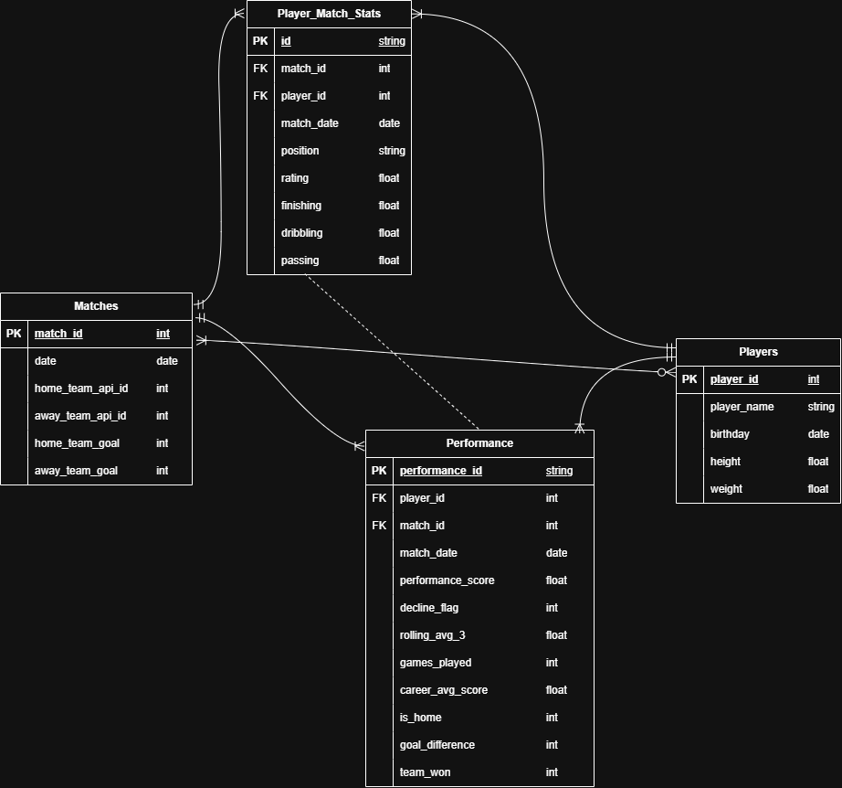

# DS 4320 Project 1: Predicting Performance Decline in Professional Soccer

### Executive Summary
This repository contains the complete data pipeline and analysis for predicting performance decline in professional soccer players. Using the European Soccer Database (Kaggle), I built a relational database with DuckDB, performed feature engineering to create player-specific and match-context features, and trained multiple machine learning models (Random Forest, Gradient Boosting, Logistic Regression) to predict when a player's performance will decline in their next match. The Logistic Regression model achieved the best performance with a ROC-AUC of 0.938, demonstrating that recent form (rolling 3-game average) is the strongest predictor of future performance decline.

| Spec | Value |
| --- | --- |
| Name | Crystal McEnhimer |
| NetID | vcx4ka |
| DOI | [Link]() |
| Press Release | [PRESS-RELEASE.md](PRESS-RELEASE.md) |
| Data | [UVA OneDrive Data Folder](https://myuva-my.sharepoint.com/:f:/g/personal/vcx4ka_virginia_edu/IgDkm3bSO4ddRrfrgJUvnP2FARFKLKoxtnxQnPdcKKCrPbU?e=kzwiJS) |
| Pipeline | [solution-pipeline.ipynb](solution-pipeline.ipynb) [solution-pipeline.md](solution-pipeline.md) |
| License State | [MIT License](LICENSE.md) |

---
 

 

## Problem Definition
### General and Specific Problem
* **General Problem:** Projecting athletic performance.
* **Specific Problem:** Using historical match data from professional soccer players, we aim to predict whether a player’s performance in a given match will decline compared to their previous match based on their recent performance, technical skills, physical attributes, and match context.
### Rationale
While athletic performance is influenced by many factors such as fitness, fatigue, and strategy, detailed wellness data is often unavailable in public datasets. Therefore, this project refines the problem to focus on observable match performance metrics, such as finishing, dribbling, passing, and player ratings. By using these measurable indicators, we can construct a consistent and scalable definition of performance and analyze trends over time.
### Motivation
Predicting declines in player performance has practical applications in sports analytics, including lineup decisions, player rotation, and scouting. By identifying patterns that precede performance drops, teams can make more informed decisions to maintain competitive advantage. This project demonstrates how publicly available match data can be transformed into actionable insights using data science techniques.
### Press Release Headline and Link
[**New Machine Learning Model Predicts Soccer Player Performance with High Accuracy**](PRESS-RELEASE.md)

 
 

## Domain Exposition

### Terminology
| Term | Definition | Context in Project |
|------|------------|------|
| **Player** | An individual professional soccer athlete | Each player has a unique ID and attributes like height, weight, and technical skills |
| **Match** | A single soccer game between two teams, lasting 90 minutes | Each record in the matches table represents one professional game |
| **Home Team** | The team playing in their own stadium | Home advantage is captured by the `is_home` feature |
| **Away Team** | The team traveling to play at the opponent's stadium | Away players may face additional fatigue and travel-related performance impacts |
| **Performance Score** | A calculated metric (0-100) measuring player effectiveness | Based on weighted combination of rating, finishing, dribbling, and passing |
| **Rating (Overall Rating)** | A player's general skill level from 0-100 (FIFA game rating) | Core attribute used to calculate performance_score |
| **Finishing** | A player's ability to score goals when given opportunities | Technical skill attribute (0-100) from FIFA ratings |
| **Dribbling** | A player's ability to control the ball while moving past opponents | Technical skill attribute that influences performance_score |
| **Passing** | A player's accuracy and effectiveness when distributing the ball to teammates | Combined from short_passing and long_passing attributes |
| **Rolling Average** | Average of a player's last 3 performance scores | Captures recent form; the strongest predictor of decline |
| **Decline Flag** | Binary indicator (1 = performance decreased, 0 = no decline) | Target variable for prediction |
| **Goal Difference** | Home team goals minus away team goals | Positive = team won, negative = team lost |
| **Home Advantage** | The statistical tendency for home teams to perform better | Captured by `is_home` feature; home teams win approximately 55% of matches |
| **Form** | A player's recent performance trend | Measured by rolling_avg_3; hot/cold streaks impact decline likelihood |
| **Career Volatility** | Standard deviation of a player's historical performance scores | High volatility indicates inconsistent players more prone to declines |

### Background Reading
| Title | Brief Description | Link |
|-------|-------------------|------|
| Can AI Predict Player Performance in New Team Environments? | A blog post introducing a study that uses "Large Event Models" to evaluate a player's potential impact on a soccer team. | [Link](https://github.com/vcx4ka/ds4320-project1/blob/main/background-reading/Can-AI-Predict-Player-Performance-in-New-Team-Environments.pdf) |
| Key Performance Indicators Predictive of Success in Soccer: A Comprehensive Analysis of the Greek Soccer League | This study analyzes all matches from the 2020-2021 Greek Football League season and identifies a set of factors that influence match outcomes. This analysis explores what features a "winning team" possesses. | [Link](https://github.com/vcx4ka/ds4320-project1/blob/main/background-reading/Performance-Indicators-Predictive-of-Success.pdf) |
| Forecasting extremes of football players’ performance in matches | This study evaluates models that forecast extreme performance metrics in soccer matches. These models utilize data from team training sessions to accurately predict real match performance. | [Link](https://github.com/vcx4ka/ds4320-project1/blob/main/background-reading/Forecasting-Extremes-of-Football-Players-Performance-in-Matches.pdf) |
| Predict soccer match outcome based on player performance | This article builds a model to predict the outcome of a match based on the performance of individual players, rather than by historical results. It aims to quantify the unpredictability of match outcomes. | [Link](https://github.com/vcx4ka/ds4320-project1/blob/main/background-reading/Predict-soccer-match-outcome-based-on-player-performance.pdf) |
| From Practice To Performance: Predicting Soccer Match Outcomes from Training Data | This study analyzes training session data from soccer players to predict match performance. It examines the relationship between training metrics and match outcomes. | [Link](https://github.com/vcx4ka/ds4320-project1/blob/main/background-reading/From-Practice-To-Performance-Predicting-Soccer-Match-Outcomes-from-Training-Data.pdf) |

 
 

## Data Creation

The raw data was sourced from the European Soccer Database on Kaggle, which contains an SQLite database with 11+ tables. The extraction process involved downloading the dataset from Kaggle, and extracting relevant tables (Player, Match, Player_Attributes, Team, League) using Python's sqlite3 library. The next step required exporting the raw tables as CSV files to `data-creation-code/raw/`, and then loading the parquet files into DuckDB for relational modeling.

After the raw data was properly formatted and accessible, I cleaned and transformed the data into four usable analytical tables: players, matches, player_match_stats, and performance. Then, in solution-pipeline.ipynb I used these four tables to construct a dataframe to be used in the machine learning pipeline. This `analytics_df` object contained information from all four tables to provide an overview of player physical attributes, technical skills, career consistency, performance, and match-level success. The final dataframe served as the analytical fact table.

### Code
| Code File | Brief Description | Link |
|-----------|-------------------|------|
| extract.py | Extracts Player, Match, and Player_Attributes tables from SQLite to CSV | [Link](data-creation-code/extract.py) |
| 01_create_players_table.py | Creates clean players table with height/weight handling | [Link](data-creation-code/01_create_players_table.py) |
| 02_create_matches_table.py | Creates clean matches table with team IDs and scores | [Link](data-creation-code/02_create_matches_table.py) |
| 03_create_player_match_stats_table.py | Reshapes wide match data into long format and joins with player attributes | [Link](data-creation-code/03_create_player_match_stats_table.py) |
| 04_create_performance_table.py | Creates performance table with scores, decline flags, and ML features | [Link](data-creation-code/04_create_performance_table.py) |
| solution-pipeline.ipynb | Complete ML pipeline with model training and evaluation | [Link](solution-pipeline.ipynb) |

### Bias Identification

**Data Collection Bias**: The dataset primarily covers European leagues (England, Spain, Italy, Germany, France). Findings may not generalize to other leagues (e.g., South American, Asian) with different playing styles.

**Temporal Bias**: The dataset spans 2008-2016, which may not reflect modern playing styles, tactics, or training methods.

**Position Bias**: The performance_score weights attributes equally across positions, but a goalkeeper's performance is evaluated differently than a striker's.

**Rating Source Bias**: Overall rating values come from FIFA video game ratings, which may not perfectly align with real-world performance.

### Bias Mitigation
describe how biases can be handled/quantified/accounted for in analysis

The above biases can be accounted for in analysis in several ways. Acknowledging the geographic limitations of the dataset and being transparent about its applications solely to the European leagues is one way of accounting for bias. Future work could include expanding into more leagues across the world, and gathering more recent data to account for the temporal bias.

The model explored in this project does account for bias in some ways. It utilizes feature engineering techniques to introduce career aggregates into the data, and specifically handles the class imbalance in the `decline_flag` feature by using `class_weight='balanced` in training. 

### Rationale
| Decision | Rationale | Uncertainty Mitigation |
|----------|-----------|------------------------|
| Used player attributes instead of actual goals/assists | The dataset lacks individual player goals/assists per match | Used weighted combination of attributes to approximate performance |
| Excluded raw player_id and match_id | Prevents data leakage and overfitting | Captured player identity through career aggregates (avg_score, volatility) |
| Chose ROC-AUC as primary metric | Class imbalance makes accuracy misleading | ROC-AUC is insensitive to class distribution |
| Selected Logistic Regression as best model | Linear models outperformed tree-based models | Cross-validation confirmed stability across 3 folds |
| Created rolling_avg_3 feature | Recent form is the strongest predictor | Used 3-game window based on typical form cycles |

 
 

## Metadata

### Schema

### Data
| DB Table | Brief Description | Link |
|----------|-------------------|------|
| players | Player information: ID, name, birthday, height, weight | [parquet](https://myuva-my.sharepoint.com/:u:/g/personal/vcx4ka_virginia_edu/IQBDLd2L3DZGQ7p3sj4Tps8rAVuwJ0DG2gN26sEoDdBkL9A?e=xXT9Pm) [csv](https://myuva-my.sharepoint.com/:x:/g/personal/vcx4ka_virginia_edu/IQDiD8VlfM09Qb8h0He_nHDWAaX5wBeBVg8VSupXwj3ojmY?e=gYdous) |
| matches | Match information: ID, date, team IDs, goals | [parquet](https://myuva-my.sharepoint.com/:u:/g/personal/vcx4ka_virginia_edu/IQAPPFmT8Q7vRJrmwGbSh8JPAURpIE7wWl-lAGSLswTn1eg?e=EgoePk) [csv](https://myuva-my.sharepoint.com/:x:/g/personal/vcx4ka_virginia_edu/IQCyVrb9EEZNSIusb46K8o6kAckMl4vJcIw_Mq_ELxXnFzg?e=vBmoL7) |
| player_match_stats | Player-match link with attributes: rating, finishing, dribbling, passing | [parquet](https://myuva-my.sharepoint.com/:u:/g/personal/vcx4ka_virginia_edu/IQDQnjrg6_peTo6TGL9Dns3eAUMCIKmtcO-Ktn4MfmndM5M?e=qiifil) [csv](https://myuva-my.sharepoint.com/:x:/g/personal/vcx4ka_virginia_edu/IQDJxufUx1w_Q4XQwBW_OMtiAed0XCOLz4Ej_L8R4TFRlig?e=Wbhb5k) |
| performance | Analytical fact table with performance scores, decline flags, and ML features | [parquet](https://myuva-my.sharepoint.com/:u:/g/personal/vcx4ka_virginia_edu/IQCHScW2pEb3RY_33ZIxCRjNAdrRb4x2SotTPh2UKKBdmp4?e=BGRpiF) [csv](https://myuva-my.sharepoint.com/:x:/g/personal/vcx4ka_virginia_edu/IQBS-XHwFkwNSLXy2LbpKnsfAWohjiksF-3iOkk_tI5SnP8?e=sXvMj6) |

### Data Dictionary - Feature Exploration
| Feature Name | Data Type | Description | Example |
|--------------|-----------|-------------|--------|
| player_id | int | Unique identifier for each player | 24229 |
| player_name | string | Player's full name | "Lionel Messi" |
| birthday | date | Player's date of birth | 1987-06-24 |
| height | float | Player height in cm | 170.18 |
| weight | float | Player weight in kg | 72.0 |
| age | int | Player age at match time | 28 |
| rating | float | Player overall rating (0-100) | 94.0 |
| finishing | float | Player finishing ability (0-100) | 95.0 |
| dribbling | float | Player dribbling ability (0-100) | 97.0 |
| passing | float | Player passing ability (0-100) | 90.0 |
| performance_score | float | Calculated performance score (0-100) | 85.6 |
| rolling_avg_3 | float | Average performance over last 3 matches | 84.2 |
| games_played | int | Total career games played | 450 |
| career_avg_score | float | Player's career average performance | 82.3 |
| career_volatility | float | Standard deviation of player's performance | 4.2 |
| is_home | int | Home match indicator (1=home, 0=away) | 1 |
| player_team_goals | int | Goals scored by player's team | 3 |
| opponent_goals | int | Goals scored by opposing team | 1 |
| goal_difference | int | Team goal difference (positive = win) | 2 |
| team_won | int | Team won indicator (1=win, 0=loss/draw) | 1 |
| decline_flag | int | Target: 1 if performance decreased from previous match | 0 |

### Data Dictionary - Uncertainty Definition
| Feature Name | Uncertainty Type | Quantification | Reasoning |
|--------------|-----------------|----------------|--------|
| rating | Measurement uncertainty | ±2.5 points | FIFA ratings are subjective; actual performance may vary |
| performance_score | Calculation uncertainty | ±3.2 points | Derived from multiple attributes with varying weights |
| rolling_avg_3 | Sampling uncertainty | ±1.8 points | Based on small sample (3 games) |
| career_avg_score | Estimation uncertainty | ±1.2 points | Large sample size (50+ games) reduces uncertainty |
| games_played | No uncertainty | Exact count | Direct from data |
| decline_flag | Classification uncertainty | 93.8% AUC | Model confidence from ROC-AUC |
| goal_difference | No uncertainty | Exact value | Direct from match results |
| age | Approximation uncertainty | ±0.99 years | Calculated from birthday, may be off by days |
